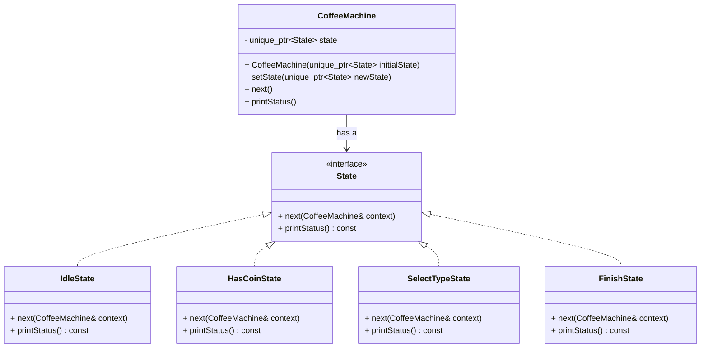

# 🧬  State Design Pattern
The State pattern is a behavioral design pattern that implements a state machine in an object-oriented way.
With the State pattern, each state is implemented as a derived class of a state interface, and state transitions are handled by invoking methods defined by the interface.

##  Class Diagram

