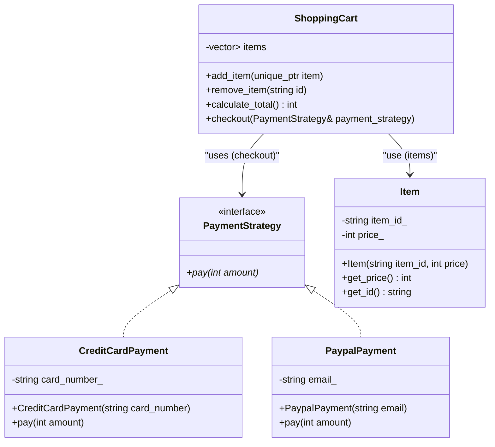

# 🧬 Strategy Design Pattern

The Strategy is a behavioral design pattern that allows you to define a set of
algorithms and encapsulate them in independent classes so that they can be used interchangeably.

## Class Diagram

