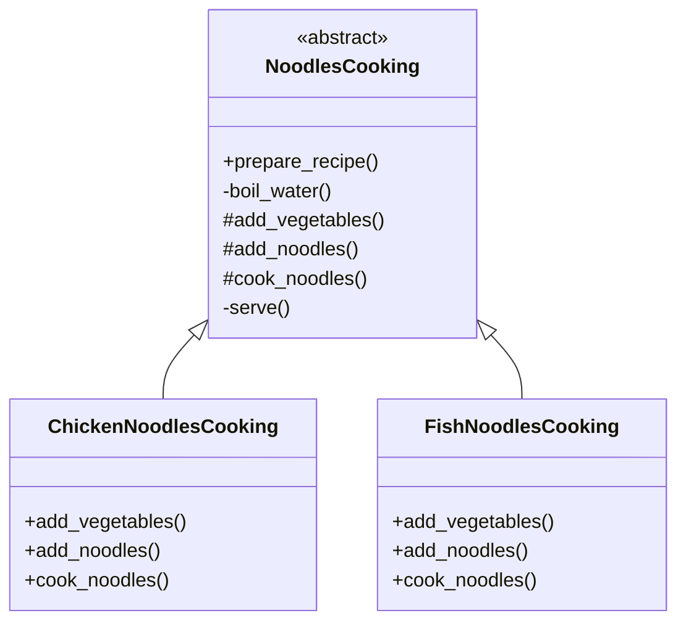

# 🧬  Template Method Design Pattern
The Template Method is a behavioral design pattern 
that defines the skeleton of an algorithm in a base 
class, allowing subclasses to redefine specific steps
without changing the overall structure of the algorithm.

# Template Method vs. Strategy
## Template Method
The Template Method emphasizes defining the structure 
of an algorithm within a common framework, while allowing 
subclasses to override certain steps as needed. 
It focuses on maintaining a fixed process, with only 
parts of the implementation customizable.

## Strategy
The Strategy Pattern emphasizes the interchangeability 
of entire algorithms. It allows you to select between 
different algorithm implementations at runtime without
altering the algorithm’s structure.

The Strategy Pattern encapsulates each algorithm in 
separate classes, making them interchangeable via a 
common interface. In contrast, the Template Method 
achieves partial customization through inheritance 
by letting subclasses override specific steps within 
a predefined process.

#  Class Diagram


# Example:
```c
const auto chicken_noodles = make_unique<ChickenNoodlesCooking>();
chicken_noodles->prepare_recipe();

const auto fish_noodles = make_unique<FishNoodlesCooking>();
fish_noodles->prepare_recipe();