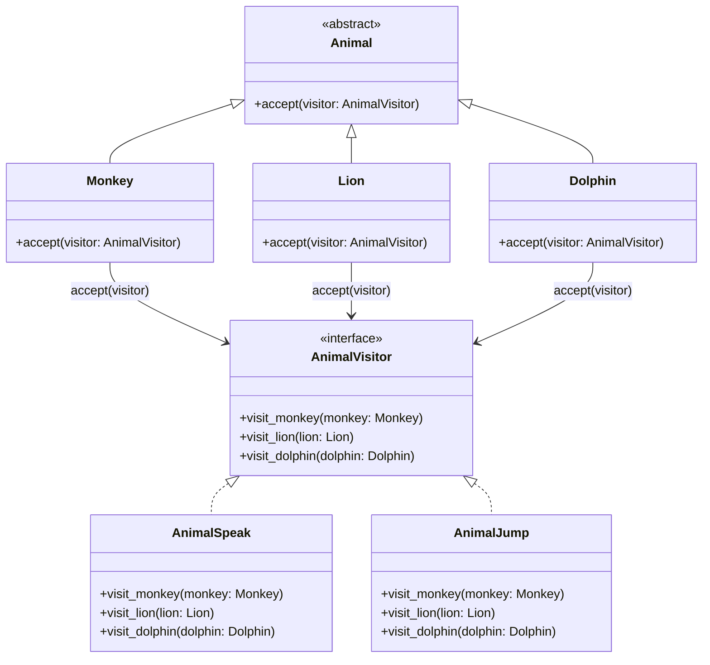

# 🧬 Visitor Method Design Pattern

The Visitor Method is a behavioral design pattern that separates
algorithm from the objects they operate on, allowing you to add
new operations without modifying the object's structure.

It's particularly useful in scenarios where the object structure
is stable, but new operations are frequently needed.

In real-world development, the Visitor pattern helps maintain
the Open/Closed Principle, enhancing the system's extensibility
and maintainability.

## Class Diagram



## Example

```cpp
Monkey monkey;
Lion lion;
Dolphin dolphin;

AnimalSpeak animal_speak;
monkey.accept(animal_speak);
lion.accept(animal_speak);
dolphin.accept(animal_speak);

cout<< "================ \n";

AnimalJump animal_jump;
monkey.accept(animal_jump);
lion.accept(animal_jump);
dolphin.accept(animal_jump);
```
## Output
```
 Monkey shout: Ooh oo aah! 
 Lion roar: Roaaarr! 
 Dolphin speak:Tuut tuut tuut! 
 ================ 
 Monkey jumped 5 meter heigh on the tree 
 Lion jumped 3 meters on the ground! 
 Dolphin jumped 2 meters out of the water! 
 ```
