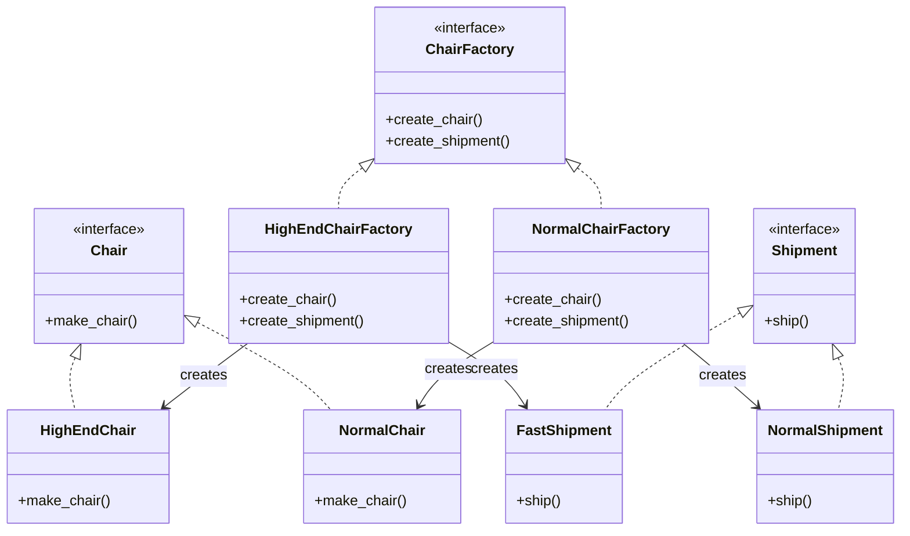

# 🧬 Abstract Factory Design Pattern
The Abstract Factory design pattern is a creational design pattern that 
provides an interface for creating families of related or dependent objects
without specifying their concrete classes. It is often referred to as a 
"factory of factories" because it provides a way to encapsulate a group of 
individual factories that share a common theme.

##  Class Diagram

