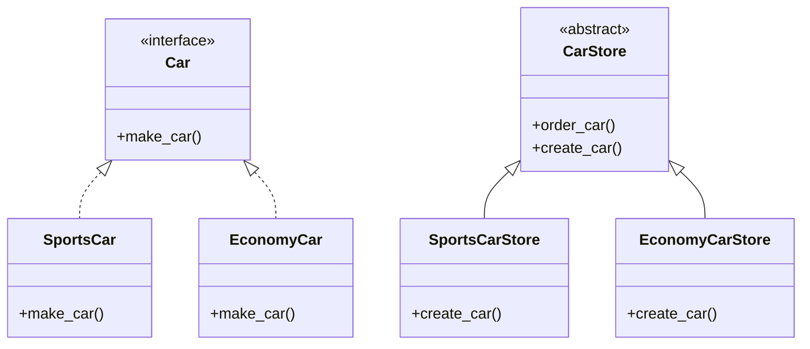

# 🧬 Factory Method Design Pattern 

Factory Method is a creational design pattern that provides an interface
for creating objects in a superclass, but allows subclasses to alter the 
type of objects that will be created.

##  Class Diagram

