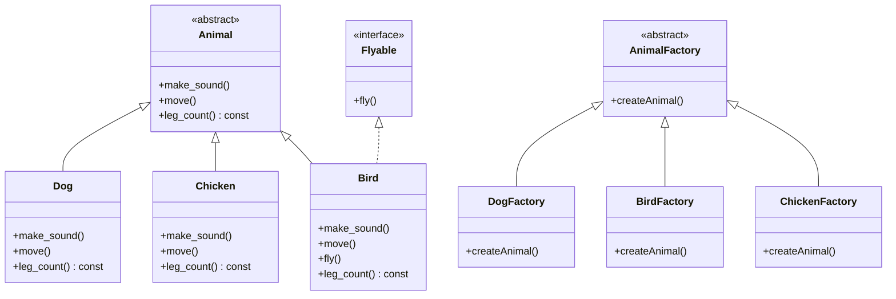

# 🧬 Factory Method Design Pattern 
##  Class Diagram

```mermaid
classDiagram

%% Interfaces / Abstract classes
    class Animal {
        <<abstract>>
        +make_sound()
        +move()
        +leg_count() const
    }

    class Flyable {
        <<interface>>
        +fly()
    }

    class AnimalFactory {
        <<abstract>>
        +createAnimal()
    }

%% Concrete Animal classes
    class Dog {
        +make_sound()
        +move()
        +leg_count() const
    }

    class Bird {
        +make_sound()
        +move()
        +fly()
        +leg_count() const
    }

    class Chicken {
        +make_sound()
        +move()
        +leg_count() const
    }

%% Concrete Factory classes
    class DogFactory {
        +createAnimal()
    }

    class BirdFactory {
        +createAnimal()
    }

    class ChickenFactory {
        +createAnimal()
    }

%% Relationships
    Animal <|-- Dog
    Animal <|-- Chicken
    Animal <|-- Bird


    Flyable <|.. Bird

    AnimalFactory <|-- DogFactory
    AnimalFactory <|-- BirdFactory
    AnimalFactory <|-- ChickenFactory


```
