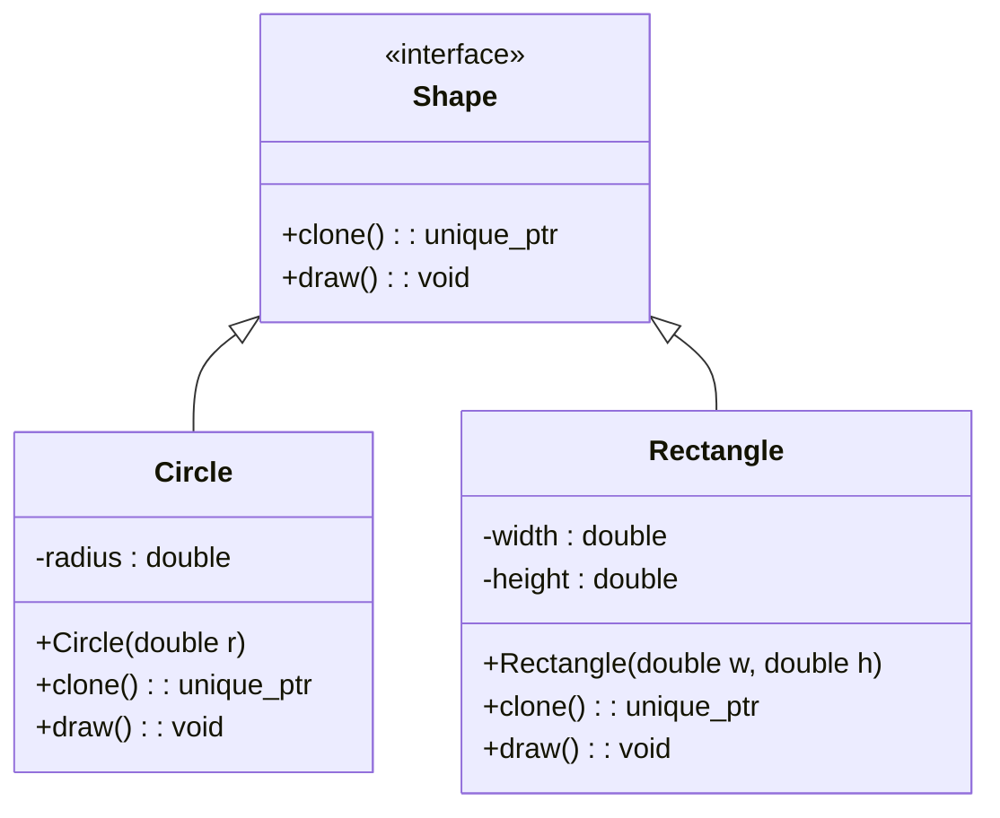

# 🧬  Prototype Design Pattern

Prototype is a Creational Design Pattern that lets you copy existing objects 
without making your code dependent on their classes.

##  Class Diagram

```mermaid
classDiagram
    class Shape {
        <<interface>>
        +clone() : unique_ptr<Shape>
        +draw() : void
    }

    class Circle {
        -radius : double
        +Circle(double r)
        +clone() : unique_ptr<Shape>
        +draw() : void
    }

    class Rectangle {
        -width : double
        -height : double
        +Rectangle(double w, double h)
        +clone() : unique_ptr<Shape>
        +draw() : void
    }

    Shape <|-- Circle
    Shape <|-- Rectangle


```